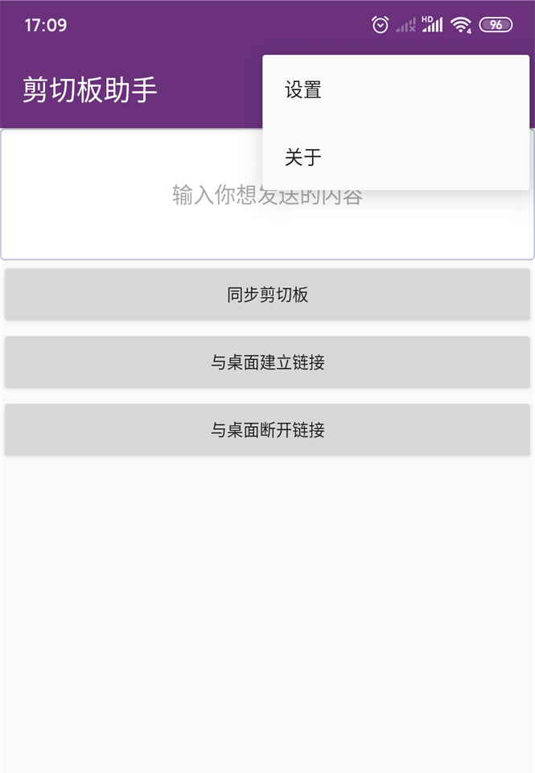
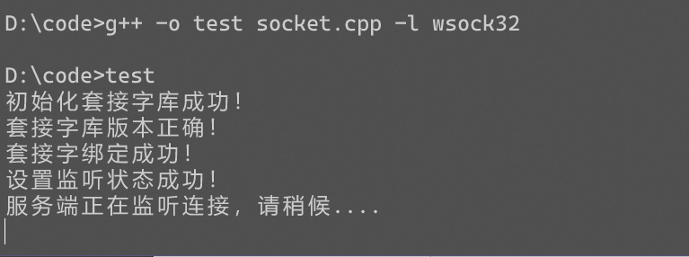

# copy-and-paste-between-android-and-windows
cloud-clipboard between android and windows

#### 可以在android平台和windows平台串流剪切板数据

- 编译windows端程序

- 运行C++程序

- 在app上配置windows.IP和windows.port

- 端口注意与cpp中的端口一致

- 在app上建立连接,同步即可

  

#### 截图

- android

  

- windows

  

